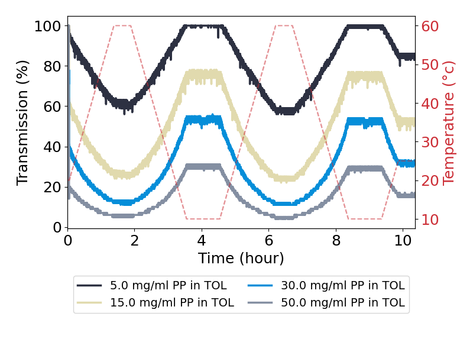
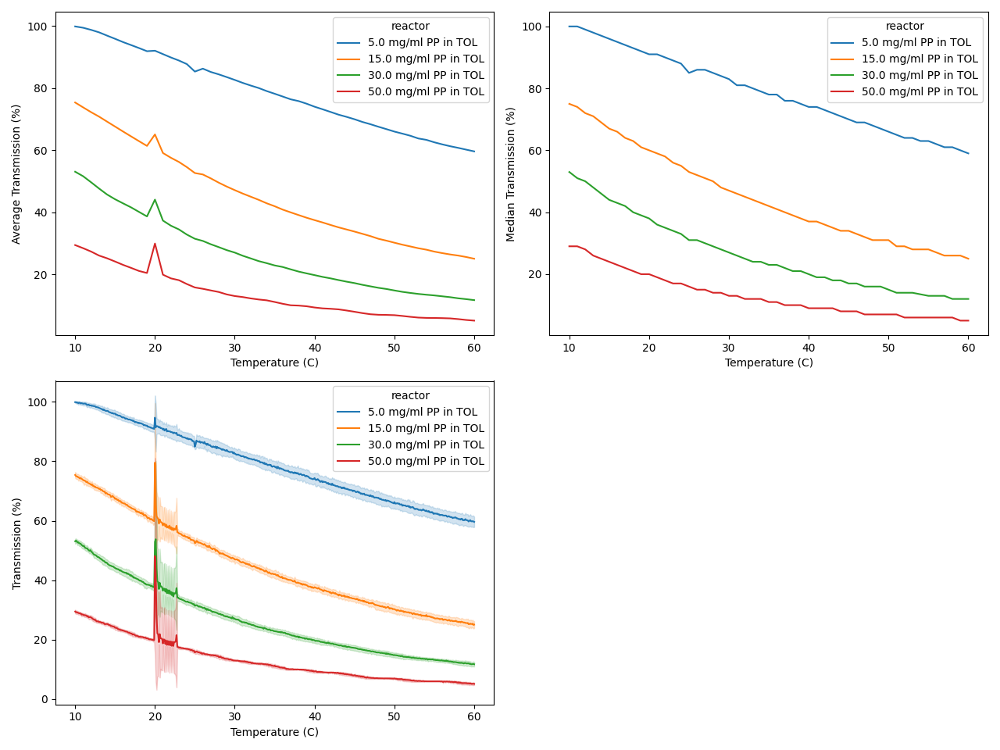

# CSST Analyzer

CSST automatically loads and processes Crystal 16 Dissolution/Solubility Data

## User Guide
This guide gives an overview of two modules within the CSST package:

1. Experiment: loads experiment data
2. Analyzer: analyzes and processes and loaded experiment data

### Experiment
To load CSST experiments, the following code is used

```Python
from pathlib import Path

from csst.experiment import Experiment

experiment = Experiment.load_from_file(
    str(Path("data") / "MA-PP-TOL-5-15-30-50 mg.csv")
)
```

This will load all of the data from the csv file into an experiment object. If you would like, you can load multiple experiments

```Python
experiment_folder = Path("data")
exp1 = Experiment.load_from_file(
    str(experiment_folder / "MA-PP-TOL-5-15-30-50 mg.csv")
)
exp2 = Experiment.load_from_file(
    str(experiment_folder / "MA-PEG-TOL -5-15-30-50 mgpmL")
)
```

For the remainder of the guide, I will assume you have loaded two experiments.

The reactors are stored in a list instance variable in the experiment and can be extracted using a dot operator and list indexing. The reactor polymer, solvent, and concentration can be extracted as below.

```Python
# could access by list index as well
for reactor in exp1.reactors:
	print(f"{reactor.polymer} in {reactor.solvent}")
	print(f"concentration is {reactor.conc.value} {reactor.conc.unit}")
	print(reactor)
```

## Analyzer
The analyzer can analyze as many **experiment reactors** as desired. To load the reactors into the analyzer, two methods are available:

```Python
from pathlib import Path

from csst.experiment import Experiment
from csst.analyzer import Analyzer

experiment_folder = Path("data")
exp1 = Experiment.load_from_file(
    str(experiment_folder / "MA-PP-TOL-5-15-30-50 mg.csv")
)
exp2 = Experiment.load_from_file(
    str(experiment_folder / "MA-PEG-TOL -5-15-30-50 mgpmL.csv")
)

# method one
analyzer = Analyzer()
analyzer.add_experiment_reactors(exp1)

# method two
for reactor in exp2.reactors:
	analyzer.add_reactor(reactor)
```

The analyzer stores the processed data and the unprocessed data in a pandas dataframe:

```Python
# processed data
print(analyzer.df)

# unprocessed data
print(analyzer.unprocessed_df)
```

The processed reactors can also be accessed:

```Python
# polymer and solvent can be accessed from the unprocessed reactor
print(analyzer.processed_reactors[0].unprocessed_reactor.polymer)

# processed temperatures can be accessed from a list
temp = analyzer.processed_reactors[0].temperatures[0]

# each processed temperature has a variety of statistics available
# temperature transmission data evaluated at
print(temp.average_temperature)

# range of temperatures around the average. Each transmission evaluation at the
# average temperature +/- temperature_range / 2
print(temp.temperature_range)

# average transmission and transmission standard deviation
print(temp.average_transmission)
print(temp.transmission_std)

# median transmission
print(temp.median_transmission)
```

This data can be interesting to look at, but the processed and unprocessed data will probably be analyzed in the dataframe instead.

### Plotting
To plot one experiment's transmission and temperature vs time, the following code can be used

```Python
from pathlib import Path

import matplotlib.pyplot as plt
from csst.experiment import Experiment
from csst.analyzer.plotter import plot_experiment

# Running this script a folder that contains a folder called 'data' with a file in that
# folder called 'MA-PP-TOL-5-15-30-50 mg.csv'
experiment = Experiment.load_from_file(
    str(Path("data") / "MA-PP-TOL-5-15-30-50 mg.csv")
)
fig = plot_experiment(experiment)
plt.show()
```

Resulting in the a plot like so:



To plot the processed and unprocessed data, the following code can be used:

```Python
fig, axes = plt.subplots(nrows=2, ncols=2, tight_layout=True, figsize=(12.8, 9.6))
sns.lineplot(
    x="average_temperature",
    y="average_transmission",
    hue="reactor",
    data=analyzer.df,
    ax=axes[0][0],
)
axes[0][0].set_xlabel("Temperature (C)")
axes[0][0].set_ylabel("Average Transmission (%)")

sns.lineplot(
    x="average_temperature",
    y="median_transmission",
    hue="reactor",
    data=analyzer.df,
    ax=axes[0][1],
)
axes[0][1].set_xlabel("Temperature (C)")
axes[0][1].set_ylabel("Median Transmission (%)")

sns.lineplot(
    x="temperature",
    y="transmission",
    errorbar="sd",
    hue="reactor",
    data=analyzer.unprocessed_df,
    ax=axes[1][0],
)
axes[1][0].set_xlabel("Temperature (C)")
axes[1][0].set_ylabel("Transmission (%)")
# delete left over axes
fig.delaxes(axes[1][1])
plt.show()
```
Resulting in the following image:



## Install
`poetry add git+ssh://git@github.com/jdkern11/csst\_analyzer.git#v1.4.0`

### With database extra
`poetry add git+ssh://git@github.com/jdkern11/csst\_analyzer.git#v1.4.0 --extras db`

To connect to the database, you must configure a .env file with the following parameters
```
# equal the appropriate values
CSST_DB_USER=
CSST_DB_PASSWORD=
CSST_DB_HOST=
CSST_DB_PORT=
CSST_DB_NAME=
SSH_TUNNEL_HOST=
SSH_TUNNEL_PORT=
SSH_USERNAME=
SSH_PASSWORD=
SSH_PRIVATE_KEY_PASSWORD=
```

To connect, then use something like the below code
```Python
import os
from sqlalchemy import create_engine
from sqlalchemy.orm import sessionmaker
from dotenv import load_dotenv
from sshtunnel import SSHTunnelForwarder

dotenv_path = 'path/to/.env'
load_dotenv(str(dotenv_path))
server = SSHTunnelForwarder(
    (os.environ.get("SSH_TUNNEL_HOST"), int(os.environ.get("SSH_TUNNEL_PORT"))),
    ssh_username=os.environ.get("SSH_USERNAME"),
    ssh_password=os.environ.get("SSH_PASSWORD"),
    remote_bind_address=(
        os.environ.get("CSST_DB_HOST"),
        int(os.environ.get("CSST_DB_PORT")),
    ),
)
server.start()
db_connection = "postgresql+psycopg2://{}:{}@{}:{}/{}_test".format(
    os.environ.get("CSST_DB_USER"),
    os.environ.get("CSST_DB_PASSWORD"),
    os.environ.get("CSST_DB_HOST"),
    server.local_bind_port,
    os.environ.get("CSST_DB_NAME"),
)
engine = create_engine(db_connection)
Session = sessionmaker(engine)
...
server.stop()
```

## Developer TODOs
- [x] Load descriptions from CSST files
- [ ] Parse descriptions from CSST files
- [x] Skip tuning sections of data collection prior to processing
- [x] Add ability to upload raw data to a database
- [x] Add ability to load raw data from a database
- [ ] Add ability to upload processed data to a database
- [ ] Add ability to load processed data from a database
